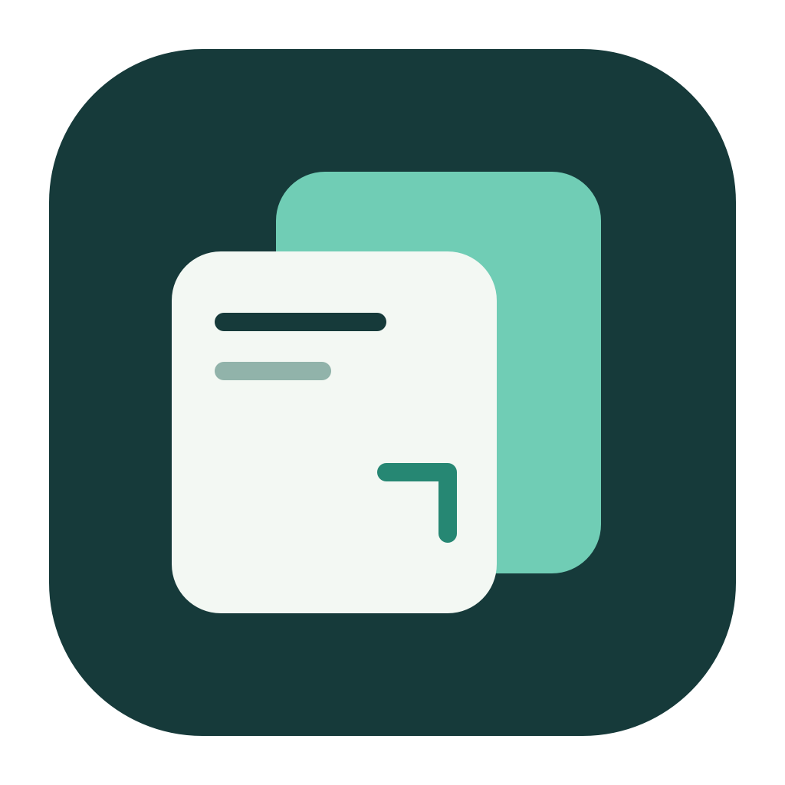

# Pageglass



[下载 macOS ARM64 预览版](https://github.com/meaglovex/pageglass/releases) · [MIT License](LICENSE)

给产品经理的轻量 macOS 浏览器。浏览网页，选取一个元素或捕获整个已加载页面，把视觉、结构与交互状态交给本机 Codex。

**已发布 0.6.0；当前分支为 0.8.0-alpha.1 开发版，macOS 14+ / Apple Silicon。** 原生 Swift + AppKit + 系统 WebKit，零第三方包依赖。尚未证明 Chrome 级性能、全站兼容性或更低的整组进程内存占用，不作为 Chrome 的完整替代品宣传。

## 打开

```sh
scripts/build.sh
open dist/Pageglass.app
```

也可以把生成的 `Pageglass.app` 拖到「应用程序」。本地构建使用临时签名，尚未做 Developer ID 签名、公证及正式分发。

## 使用

1. 顶部标签栏，第二行地址栏与导航按钮。`⌘L` 输入网址或搜索词，支持本地书签/历史建议；`⌘T` 新标签页，`⌘W` 关闭，`⌘⇧T` 恢复。标签可复制、拖动排序，关闭其他/右侧标签。
2. 点击「捕获」（`⌘⇧C`），移动鼠标高亮元素，`↑` 或「上一级」扩大到父级、`↓` 选第一个子级，点击或 Enter 确认，Esc 退出。选取时点击不会触发网页原操作。
3. 或从捕获下拉菜单选择「捕获已加载整页」（`⌘⇧A`），生成当前已加载文档的长截图和结构。
4. 到**同一台 Mac 上的 Codex 本地任务**粘贴，再写「在右上角增加查看详情按钮」等需求。复制的文本指向本地完整捕获包，要求 Codex 打开图片并读代码；不是把截图伪装成代码。
5. 结果面板「更多操作 → 复制截图」单独复制图片；「在 Finder 中显示」打开文件，可手动将文件附加到其他工具。「查看大图」支持适合窗口及 50% / 100% / 200% 缩放。

当前开发版在浏览器右侧显示捕获截图预览和缺失说明，连续捕获复用同一个面板，不改变网页视口，默认自动复制本机文件引用，可在「设置 → 捕获」关闭自动复制。捕获过程中可取消；「捕获 → 捕获历史」可查找旧记录、重新复制、查看禁止运行网页脚本的参考页面，以及将选定记录移入废纸篓。外部删除文件后，复制操作会检查文件是否仍可用。

「标注与备注」可修改显示名称、写需求，添加矩形、箭头、序号和文字；保存后可再次编辑，原截图和参考不变。捕获历史增加类型、日期与备注搜索；「更多操作」可导出相对路径的 ZIP / 文件夹，供手动附加给其他工具。能力和当前限制见 [捕获整理与交付](docs/capture-editing-0.8.md)。

需要还原交互时，先从捕获下拉菜单选择「记录交互」（`⌘⇧I`），再在网页上点击、展开或切换。记录中工具栏会显示停止入口；再次点击停止。随后捕获元素或整页，会一起导出操作前后画面、结构和操作日志。

首次打开可用内置「捕获练习页」尝试，不需要登录。

## 浏览器功能

| 功能 | 入口 |
|---|---|
| 新窗口 / 无痕窗口 | `⌘N` / `⌘⇧N`，无痕隔离网站存储，不记访问、下载和会话 |
| 书签与书签栏 | 右键编辑名称/地址；地址栏星标 / `⌘D`；`⌘⇧B` 显示栏；`⌘⌥B` 管理 |
| 历史记录 | `⌘Y`，搜索、打开、确认后清除 |
| 下载管理 | 工具栏下载图标 / `⌘J`，进度、取消、打开文件、Finder 定位 |
| 快速操作 | `⌘K`，本地搜索标签、书签、历史和命令；↑↓ 选择、Enter 执行、Esc 返回 |
| 页面查找 | `⌘F`，上/下一个匹配，`⌘G` / `⌘⇧G` |
| 页面缩放 | `⌘+` / `⌘-` / `⌘0` |
| 页面保存 / 打印 | `⌘S` 保存 WebArchive / `⌘P` 系统打印面板 |
| 本地文件 | `⌘O`，HTML、WebArchive、PDF、文本、图片 |
| 扩展（开发预览） | 工具栏拼图 / 设置 → 扩展；本地目录或 ZIP 导入、逐站授权与停用，兼容边界见 [扩展说明](docs/extensions-0.8.md) |
| 设置 | `⌘,`，分组设置：主题、工具栏显隐、搜索引擎、主页、默认缩放、会话恢复、捕获自动复制/保留时间/清理与网站数据 |
| 开发者工具 | F12 / ⌥⌘I 打开或关闭 WebKit 检查器；⌥⌘J 打开控制台；页面右键检查元素 |

普通窗口默认恢复上次标签，仅加载活动标签；普通 Cookie/网站登录由系统 WebKit 持久保存。浏览器书签、历史、设置与会话存于 `~/Library/Application Support/Pageglass/browser.json`。关闭有下载的窗口会取消该窗口的未完成下载；当前不支持断点续传。

## 捕获里有什么

捕获保存在 `~/Library/Application Support/Pageglass/Captures/`，不会自动上传，也不进入本项目 Git。设置中可选择永不过期（默认）、1 / 7 / 30 天，或手动清除全部；清理会移入废纸篓，启动和运行期间每小时检查，退出期间不运行。清理后原复制路径失效，仍指向该捕获的剪贴板会一并清空；其他应用已经粘贴的内容不受影响。

| 文件 | 用途 |
|---|---|
| `screenshot.png` | 元素可见区域截图，或逐屏拼接的长截图 |
| `reference.html` | DOM + 去重的计算样式 + 伪元素 + 可读字体声明；可直接打开参考 |
| `capture.json` | 元素位置、视口、来源、资源地址、按钮/链接/ARIA 当前状态、限制说明 |
| `PROMPT.txt` | 与「复制给 Codex」相同的引用文本 |
| `interaction-history.html` | 交互记录预览入口；从这里打开各步骤页面以保留图片读取权限 |
| `interaction-history/` | 主动记录时的时间线、各步骤截图和结构 |
| `assets/` | 可读取的图片与字体离线副本；外部 SVG 图片转换为 PNG |

原页面脚本和事件属性不执行、不导出；导出 HTML 的 CSP 禁止脚本和表单提交。表单值、隐藏输入和密码输入不进入代码，但**截图仍可能包含页面上的个人信息**。使用者应按所选页面内容判断是否适合发给 AI。

## 已知边界

- 普通捕获记录当前状态；主动开启交互记录后，保存初始画面和最多 8 次操作，画面与结构合计最多 20 MiB。通常在操作后约 350ms 采样；快速操作可能仅保留日志，异步响应的所有阶段不保证覆盖。切换标签停止记录并保留已有历史，完整导航清空历史，重新开始替换旧记录。
- 业务事件闭包、服务端代码和未访问分支无法从 DOM 还原。无法承诺任意网站自动 1:1 还原全部功能。
- 样式冻结在当前视口。响应式断点、原项目组件和源码结构不保留；图片、CSS 背景/伪元素图片和可读字体会按需打包。资源读取遵守页面权限与 CORS；跨域受限、文件协议、格式不支持或预算超限的资源保留原 URL，并在 `assetManifest` / warnings 中标记，可能仍需联网。
- iframe 内部 DOM、封闭 Shadow DOM、DRM 视频不导出；Canvas 尽可能导出位图。GPU/视频截图可能留空，必须检查图片。
- 元素超出视口时只截可见部分；整页横向溢出只截当前视口宽度。虚拟列表、无限滚动的未加载项不在范围内。
- 资源最多 64 个、单个 2 MiB、合计 20 MiB，最多并发 4 个请求，总时限 12 秒；外部 SVG 图片转换为不含脚本的位图，内联 SVG 本地符号与渐变保留。跨文件 SVG 符号引用尚未内嵌。
- 代码最多约 6 MB / 6000 个元素；长截图最多 20000 CSS 像素高、30 屏或 2400 万像素，先触及哪项就按哪项截断并记录。不是无限制抓取整个网站。
- 捕获不会复制账号、Cookie、localStorage 等登录凭据；导出仍是用户选中的页面数据，不是自动脱敏产品。
- 本地版检查器使用经用户授权的私有 WebKit 接口；macOS 更新后可能需要适配，不作为 App Store 版本分发。接口不兼容时显示 Safari 备用连接说明。Mac 顶排按键用于音量时需按 fn+F12。
- 扩展宿主处于受限开发预览，真实开源插件全流程尚未验收；不支持 Chrome Web Store / CRX。当前没有账号同步和密码管理。Passkey、DRM、复杂登录与大型 Web App 兼容性未验收。
- 恢复会话时只加载当前标签，其余按需加载；「标签页 → 释放其他标签页」可释放内存，会先提示页面未保存状态可能丢失。
- 默认粘贴是本地文件引用，不会自动附上图片缩略图。云端或远程 Codex 无法直接访问这些本地路径，需要附加捕获文件。

技术决定见 [architecture.md](docs/architecture.md)，上一开发版验收进度见 [validation-0.7.md](docs/validation-0.7.md)，旧版验证记录见 [validation.md](docs/validation.md)，可复跑的性能对照方法见 [performance.md](docs/performance.md)。本版范围和验收标准见 [0.7 产品体验优化计划](docs/plan-0.7.md)（实施中）。

当前开发范围见 [0.8 视觉、操作与扩展计划](docs/plan-0.8.md)，实施状态见 [0.8 验收记录](docs/validation-0.8.md)。扩展宿主已接入开发预览并通过自有样本测试，实际 UI 与第三方插件兼容性仍未完整验收。

## 开发与开源

```sh
git clone https://github.com/meaglovex/pageglass.git
cd pageglass
swift test
scripts/build.sh
# 需登录的 macOS 图形会话；只使用自有测试页面
scripts/smoke.sh
```

源码与项目图标以 [MIT](LICENSE) 许可证开源。系统 WebKit / AppKit 不包含在仓库中，其许可由 Apple 提供；性能对照工具下载的 Speedometer 使用上游自身许可证，仅保存在被忽略的测试目录。

图标由几何图形组成；可编辑源为 `assets/icon.svg`，`swift scripts/make-icon.swift` 重新生成 PNG 和 ICNS。

贡献与问题反馈见 [CONTRIBUTING.md](CONTRIBUTING.md)。不要在公开 issue 中上传账号、Cookie 或包含个人信息的真实捕获包。
